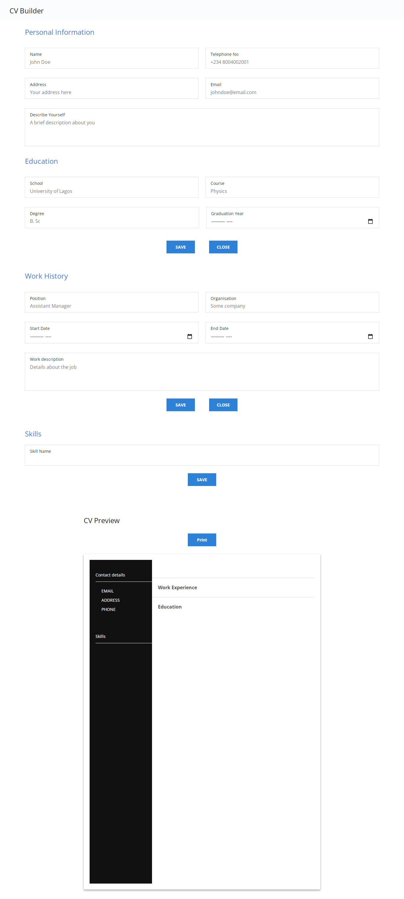

# CV Builder

A web app to generate CV based on user details.

Made as part of [The Odin's project curriculum](https://www.theodinproject.com/paths/full-stack-ruby-on-rails/courses/javascript/lessons/cv-application)

[Live Demo Here](https://peter-abah.github.io/cv-app)

## Overview
The web app consists of a form and a preview. The user enter details into the form which is reflected in the preview. When the user is done. The preview can be download in pdf format.

This main purpose of the project was to practice what I have learnt in React

### Features

- The form consists of personal info, education and work and skills sections.
- User can enter edit or delete work, education and skills details.
- A preview of the resume is shown and updated as the user enters information.
- The User can download the resume when done.

### Built With
- HTML
- CSS
- SCSS
- React

### Libraries used
- [date-fns](https://date-fns.org)
- [react-to-print](https://npmjs.com/package/react-to-print)
- [uniqid](https://npmjs.com/package/uniqid)

## Screenshot

## Contact
[Peter Abah](https://github.com/peter-abah) peterabah.ob.gmail.com
